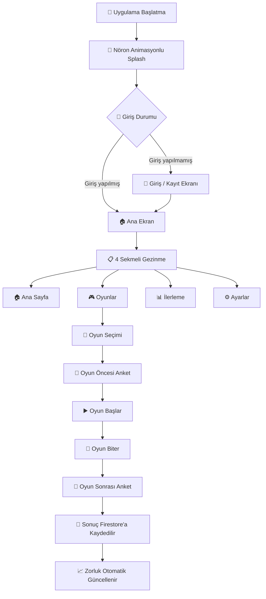

# 🧠 NöroDakika

**Bilişsel Eğitim Mobil Uygulaması**
*Beyninizi her gün bir dakikada eğitin.*


---

## 📖 Genel Bakış

**NöroDakika**, Flutter ile geliştirilmiş, bilişsel becerileri etkileşimli mini oyunlarla eğiten bir mobil uygulamadır. **8 farklı zeka türü** ve **7 bilişsel alan** üzerinden çalışan uygulama, **18 özgün mini oyun** içerir.

Platform, her oyuncu performansına göre kişiselleştirme yapan **ELO tabanlı adaptif zorluk sistemine** sahiptir. İlerleme, **radar grafiği** ile görselleştirilerek kullanıcıya bilişsel profilinin net bir resmini sunar.

### 🖼️ Ekran Görüntüleri


---

## ✨ Özellikler

| Özellik | Açıklama |
| --- | --- |
| 🧠 **7 Bilişsel Kategori** | Hafıza, Dikkat, Refleks, Mantık, Sayısal Zeka, Görsel Algı, Dil |
| 🎯 **8 Zeka Türü** | Bedensel, Görsel, Sözel, Mantıksal, Müzikal, Sosyal, İçsel, Doğacı |
| 🎮 **18 Mini Oyun** | Tüm oyunlar Flutter widget'ları olarak native yazılmıştır — WebView yok |
| 📊 **Adaptif Zorluk** | ELO tabanlı puanlama sistemi performansa göre zorluk ayarlar |
| 📈 **Radar Grafiği** | `fl_chart` ile bilişsel profil takibi |
| 📅 **Günlük Plan** | Zayıf alanları hedefleyen kişiselleştirilmiş günlük eğitim planları |
| 🔥 **Firebase Backend** | Authentication (E-posta/Şifre + Google Sign-In) + Cloud Firestore |
| 🔔 **Bildirimler** | Firebase Messaging + yerel bildirimler ile hatırlatma sistemi |
| 📝 **Oyun Anketleri** | Oyun öncesi ve sonrası duygu/düşünce anketleri |
| 🏆 **Liderlik Tablosu** | Kullanıcılar arası sıralama ve rekabet |
| 🎨 **Material 3 UI** | Modern tasarım sistemi + Google Fonts + nöron animasyonlu arkaplan |
| 🌙 **Karanlık Mod** | Tema sağlayıcı ile açık / koyu mod desteği |
| 💾 **Yerel Depolama** | SharedPreferences ile çevrimdışı oturum ve ayar kayıtları |
| 👤 **Kullanıcı Profilleri** | Özelleştirilebilir avatarlar ve kişiye özel istatistikler |
| 🌐 **Türkçe Dil Desteği** | Riverpod tabanlı dil sağlayıcı ile çoklu dil altyapısı |

---

## 🎮 Oyunlar

### Refleks ve Bedensel

| ID | Oyun | Alan | Zeka Türü | Açıklama |
| --- | --- | --- | --- | --- |
| REF01 | **Reflex Tap** | Refleks | Bedensel | Tepki süresi ölçümü + Go/No-Go mekanizması |
| REF02 | **Reflex Dash** | Refleks | Bedensel | Şeritler üzerinde kayan hedeflere hızlı tepki |
| KIN01 | **Balance Tap** | Refleks | Bedensel | Ekranın iki yanına dengeli dokunuşlarla hedefi ortada tut |

### Dikkat ve İçsel

| ID | Oyun | Alan | Zeka Türü | Açıklama |
| --- | --- | --- | --- | --- |
| ATT01 | **Stroop Tap** | Dikkat | İçsel | Renk-kelime uyumsuzluğu ile dikkat testi |
| ATT02 | **Focus Line** | Dikkat + Görsel Algı | Görsel | Yatay çizgi üzerindeki hedef renk noktalara odaklanma |
| INT01 | **Focus Check-In** | Dikkat | İçsel | Gün içi mini odak görevi ile dikkat toparla |

### Hafıza

| ID | Oyun | Alan | Zeka Türü | Açıklama |
| --- | --- | --- | --- | --- |
| MEM01 | **Path Tracker** | Mantık + Hafıza | Görsel | Görünmez nesneyi yön oklarına göre zihninde takip et |
| MEM02 | **Memory Board** | Hafıza + Görsel Algı | Görsel | Klasik kart eşleştirme hafıza oyunu |
| MEM03 | **Recall Phase** | Dil + Hafıza | Sözel | Kelime gösterim ve hatırlama testi |
| MEM04 | **Sequence Echo** | Hafıza + Dikkat | Müzikal | Gösterilen hücre sırasını aynen tekrar et |

### Mantık ve Görsel

| ID | Oyun | Alan | Zeka Türü | Açıklama |
| --- | --- | --- | --- | --- |
| LOG01 | **Logic Puzzle** | Mantık + Görsel Algı | Mantıksal | Mantık dizisi çözme + görsel algı |
| NUM01 | **Quick Math** | Sayısal Zeka | Mantıksal | Zaman baskılı mental aritmetik |
| VIS02 | **Odd One Out** | Görsel Algı + Dikkat | Görsel | Farklı kartı hızlıca bulma oyunu |
| SPA01 | **Route Builder** | Mantık + Görsel Algı | Görsel | Izgara üzerinde engelleri aşarak en kısa rota planla |

### Dil ve Sosyal

| ID | Oyun | Alan | Zeka Türü | Açıklama |
| --- | --- | --- | --- | --- |
| LANG02 | **Word Sprint** | Dil | Sözel | Gerçek ve uydurma kelimeleri ayırt etme |
| SOC01 | **Emotion Mirror** | Dil + Dikkat | Sosyal | Duygu ifadelerini eşleştir + sosyal ipuçlarını ayırt et |

### Müzik ve Doğa

| ID | Oyun | Alan | Zeka Türü | Açıklama |
| --- | --- | --- | --- | --- |
| MUS01 | **Rhythm Match** | Dikkat + Refleks | Müzikal | Ritim dizilerini doğru sırayla tekrar et |
| NAT01 | **Nature Sort** | Mantık + Görsel Algı | Doğacı | Doğa temalı nesneleri kategorilere ayır |

---

## 🛠️ Teknoloji Yığını

| Katman | Teknoloji | Detay |
| --- | --- | --- |
| Framework | Flutter | 3.0+ |
| Dil | Dart | >=3.0.0 <4.0.0 |
| State Yönetimi | Riverpod | `flutter_riverpod ^2.5.1` |
| Auth | Firebase Authentication | E-posta/Şifre + Google Sign-In |
| Veritabanı | Cloud Firestore | Oyun sonuçları ve kullanıcı istatistikleri |
| Bildirimler | Firebase Messaging | `firebase_messaging ^15.0.3` + `flutter_local_notifications ^21.0.0` |
| Yerel Depolama | SharedPreferences | Oturum ve ayar önbelleği |
| Grafikler | fl_chart | Radar grafiği ile bilişsel profil |
| HTTP | dio / http | API iletişimi |
| UI | Material 3 + Google Fonts | Modern tasarım sistemi |
| İkonlar | Font Awesome | `font_awesome_flutter ^10.7.0` |
| İzinler | Permission Handler | `permission_handler ^12.0.1` |

---

## 📁 Proje Yapısı

```text
lib/
├── core/
│   ├── api/                          # API servis katmanı
│   ├── config/                       # Uygulama konfigürasyonu
│   ├── i18n/
│   │   └── app_strings.dart          # Çoklu dil metin sabitleri
│   ├── memory/
│   │   └── memory_bank.dart          # Tüm oyun tanımları ve sabitler (tek kaynak)
│   ├── models/
│   │   ├── attempt_model.dart        # Oyun denemesi veri modeli
│   │   ├── game_model.dart           # Oyun veri modeli
│   │   └── user_model.dart           # Kullanıcı veri modeli
│   ├── utils/
│   │   └── constants.dart            # Global sabitler
│   └── widgets/
│       └── neuron_background.dart    # Nöron animasyonlu arkaplan widget'ı
├── features/
│   ├── auth/                         # Giriş ve Kayıt ekranları + provider
│   ├── game_launcher/
│   │   ├── screens/                  # Oyun listesi ve başlatıcı ekranları
│   │   └── widgets/                  # 18 mini oyun widget'ı
│   │       ├── reflex_tap_game.dart
│   │       ├── reflex_dash_game.dart
│   │       ├── balance_tap_game.dart
│   │       ├── stroop_tap_game.dart
│   │       ├── focus_line_game.dart
│   │       ├── focus_checkin_game.dart
│   │       ├── path_tracker_game.dart
│   │       ├── memory_board_game.dart
│   │       ├── recall_phase_game.dart
│   │       ├── sequence_memory_game.dart
│   │       ├── logic_puzzle_game.dart
│   │       ├── quick_math_game.dart
│   │       ├── odd_one_out_game.dart
│   │       ├── route_builder_game.dart
│   │       ├── word_sprint_game.dart
│   │       ├── emotion_mirror_game.dart
│   │       ├── rhythm_match_game.dart
│   │       └── nature_sort_game.dart
│   ├── home/                         # Ana ekran + bottom navigation
│   ├── leaderboard/                  # Liderlik tablosu
│   ├── notifications/                # Bildirim yönetim ekranları
│   ├── profile/                      # Kullanıcı profili ve avatar
│   ├── settings/                     # Tema ve dil sağlayıcıları
│   ├── shared/                       # Paylaşılan widget'lar
│   ├── stats/                        # Radar grafiği ve istatistik ekranı
│   ├── survey/                       # Oyun öncesi/sonrası anketler
│   └── welcome/                      # Splash ve karşılama ekranları
├── services/
│   ├── auth_service.dart             # Firebase Authentication servisi
│   ├── firestore_service.dart        # Firestore CRUD işlemleri
│   ├── local_storage_service.dart    # SharedPreferences sarmalayıcı
│   └── notification_service.dart     # Bildirim servisi
├── firebase_options.dart             # Firebase konfigürasyonu
└── main.dart                         # Uygulama giriş noktası
```

---

## 🚀 Başlangıç

### Gereksinimler

- Flutter SDK 3.0 veya üzeri
- Dart SDK *(Flutter ile birlikte gelir)*
- Android Studio veya VS Code (Flutter eklentisi ile)
- Firebase projesi *(ücretsiz plan yeterlidir)*
- Android emülatör veya fiziksel cihaz

### Kurulum

1. **Depoyu klonlayın**

   ```bash
   git clone https://github.com/muhammedsali/norodakika.git
   cd norodakika
   ```

2. **Flutter bağımlılıklarını yükleyin**

   ```bash
   flutter pub get
   ```

3. **Firebase kurulumu**
   - [firebase.google.com](https://firebase.google.com) üzerinden proje oluşturun
   - **E-posta/Şifre Authentication** ve **Google Sign-In** etkinleştirin
   - **Cloud Firestore** veritabanını oluşturun
   - **Firebase Cloud Messaging** bildirim servisini aktifleştirin
   - `google-services.json` dosyasını indirip `android/app/` klasörüne yerleştirin

4. **Uygulamayı çalıştırın**

   ```bash
   flutter run
   ```

---

## 📱 Kullanıcı Akışı



---

## 🏗️ Mimari Notlar

- **SOLID Prensipler** — Proje boyunca SOLID tasarım ilkelerine uygun mimari kullanılmaktadır
- **State Yönetimi** — Tüm durum yönetimi Riverpod provider'ları ile yapılır; iş mantığında ham `setState` kullanılmaz
- **Oyunlar** — Her mini oyun `features/game_launcher/widgets/` altında kendi kendine yeten bir Flutter widget'ıdır
- **Memory Bank** — `lib/core/memory/memory_bank.dart` uygulama sabitleri için tek doğruluk kaynağıdır
- **Adaptif Zorluk** — ELO tarzı zorluk derecelendirmesi her oyun denemesinden sonra Firestore'da güncellenir
- **Çevrimdışı Destek** — SharedPreferences oturum verilerini önbelleğe aldığından uygulama bağlantısız çalışabilir
- **Nöron Arkaplanı** — Splash ekranında dinamik nöron ağı animasyonu `CustomPainter` ile çizilir
- **Bildirim Sistemi** — Firebase Messaging + yerel bildirimler ile gün içi eğitim hatırlatmaları

---

## 🤝 Katkıda Bulunma

Katkılarınız, hata raporlarınız ve özellik istekleriniz memnuniyetle karşılanır!

1. Depoyu fork edin
2. Feature branch oluşturun: `git checkout -b feature/yeni-ozellik`
3. Değişikliklerinizi commit edin: `git commit -m "feat: yeni özellik eklendi"`
4. Push yapın ve Pull Request açın

---

## 📄 Lisans

Bu proje özel olarak geliştirilmektedir. Tüm haklar saklıdır.
Kullanım izinleri için depo sahibiyle iletişime geçin.

---

## 👤 Geliştirici

**Muhammed Sali** — [github.com/muhammedsali](https://github.com/muhammedsali)

---

Beyninizi her gün bir dakikada eğitin. 🧠⚡
