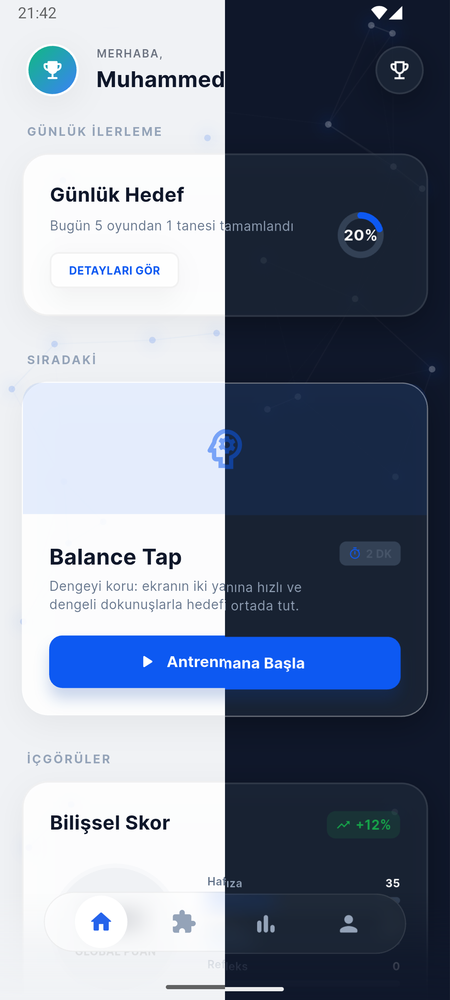
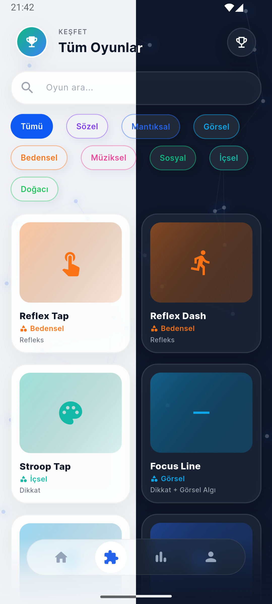
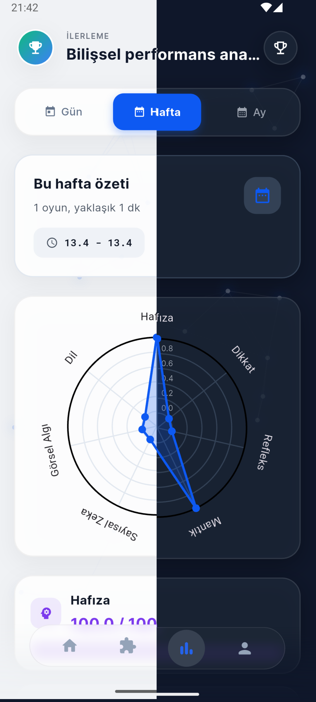
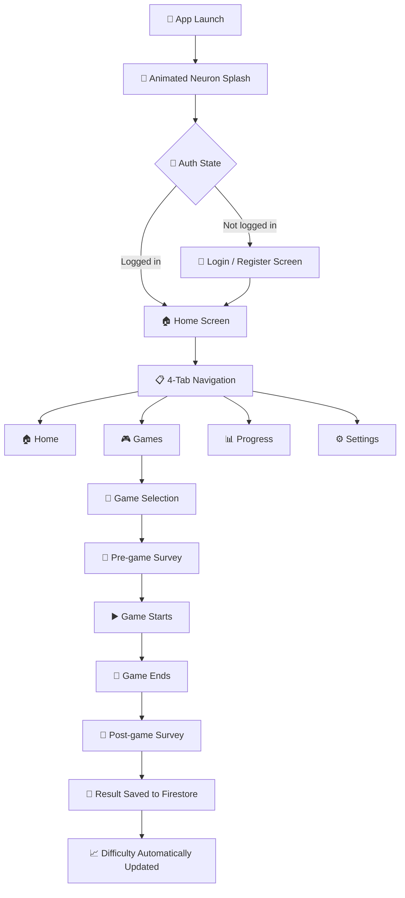

# 🧠 NöroDakika

**Cognitive Training Mobile Application**
*Train your brain in a minute every day.*


---

## 📖 Overview

**NöroDakika** is a mobile application developed with Flutter that trains cognitive skills through interactive mini-games. Operating across **8 different intelligence types** and **7 cognitive domains**, the app features **18 unique mini-games**.

The platform incorporates an **ELO-based adaptive difficulty system** that personalizes the experience based on each player's performance. Progress is visualized through a **radar chart**, providing users with a clear picture of their cognitive profile.

### 🖼️ Screenshots





---

## ✨ Features

| Feature | Description |
| --- | --- |
| 🧠 **7 Cognitive Domains** | Memory, Attention, Reflex, Logic, Numerical Intelligence, Visual Perception, Language |
| 🎯 **8 Intelligence Types** | Bodily-Kinesthetic, Visual-Spatial, Verbal-Linguistic, Logical-Mathematical, Musical, Interpersonal, Intrapersonal, Naturalistic |
| 🎮 **18 Mini-Games** | All games are written natively as Flutter widgets — no WebViews |
| 📊 **Adaptive Difficulty** | ELO-based scoring system adjusts difficulty according to performance |
| 📈 **Radar Chart** | Cognitive profile tracking using `fl_chart` |
| 📅 **Daily Plan** | Personalized daily training plans targeting weak areas |
| 🔥 **Firebase Backend** | Authentication (Email/Password + Google Sign-In) + Cloud Firestore |
| 🔔 **Notifications** | Reminder system powered by Firebase Messaging + local notifications |
| 📝 **Game Surveys** | Pre- and post-game mood/thought surveys |
| 🏆 **Leaderboard** | Ranking and competition among users |
| 🎨 **Material 3 UI** | Modern design system + Google Fonts + animated neuron background |
| 🌙 **Dark Mode** | Light / Dark mode support via theme provider |
| 💾 **Local Storage** | Offline session and settings caching using SharedPreferences |
| 👤 **User Profiles** | Customizable avatars and personalized statistics |
| 🌐 **Localization** | Multi-language infrastructure using Riverpod-based language provider |

---

## 🎮 Games

### Reflex and Bodily-Kinesthetic

| ID | Game | Domain | Intelligence Type | Description |
| --- | --- | --- | --- | --- |
| REF01 | **Reflex Tap** | Reflex | Bodily-Kinesthetic | Reaction time measurement + Go/No-Go mechanism |
| REF02 | **Reflex Dash** | Reflex | Bodily-Kinesthetic | Quick reaction to sliding targets on lanes |
| KIN01 | **Balance Tap** | Reflex | Bodily-Kinesthetic | Keep the target centered with balanced taps on both sides |

### Attention and Intrapersonal

| ID | Game | Domain | Intelligence Type | Description |
| --- | --- | --- | --- | --- |
| ATT01 | **Stroop Tap** | Attention | Intrapersonal | Attention test using color-word mismatch |
| ATT02 | **Focus Line** | Attention + Visual | Visual-Spatial | Focus on target color dots along a horizontal line |
| INT01 | **Focus Check-In** | Attention | Intrapersonal | Regain attention with a short daytime focus task |

### Memory

| ID | Game | Domain | Intelligence Type | Description |
| --- | --- | --- | --- | --- |
| MEM01 | **Path Tracker** | Logic + Memory | Visual-Spatial | Track the invisible object mentally according to directional arrows |
| MEM02 | **Memory Board** | Memory + Visual | Visual-Spatial | Classic card matching memory game |
| MEM03 | **Recall Phase** | Language + Memory | Verbal-Linguistic | Word display and recall test |
| MEM04 | **Sequence Echo** | Memory + Attention | Musical | Replicate the exact sequence of shown cells |

### Logic and Visual

| ID | Game | Domain | Intelligence Type | Description |
| --- | --- | --- | --- | --- |
| LOG01 | **Logic Puzzle** | Logic + Visual | Logical-Mathematical | Logic sequence solving + visual perception |
| NUM01 | **Quick Math** | Numerical | Logical-Mathematical | Time-pressured mental arithmetic |
| VIS02 | **Odd One Out** | Visual + Attention | Visual-Spatial | Quickly find the different card |
| SPA01 | **Route Builder** | Logic + Visual | Visual-Spatial | Plan the shortest route by navigating obstacles on a grid |

### Language and Interpersonal

| ID | Game | Domain | Intelligence Type | Description |
| --- | --- | --- | --- | --- |
| LANG02 | **Word Sprint** | Language | Verbal-Linguistic | Distinguish between real and made-up words |
| SOC01 | **Emotion Mirror** | Language + Attention | Interpersonal | Match emotional expressions + identify social cues |

### Music and Nature

| ID | Game | Domain | Intelligence Type | Description |
| --- | --- | --- | --- | --- |
| MUS01 | **Rhythm Match** | Attention + Reflex | Musical | Repeat rhythm sequences in the correct order |
| NAT01 | **Nature Sort** | Logic + Visual | Naturalistic | Categorize nature-themed objects |

---

## 🛠️ Technology Stack

| Layer | Technology | Details |
| --- | --- | --- |
| Framework | Flutter | 3.0+ |
| Language | Dart | >=3.0.0 <4.0.0 |
| State Management | Riverpod | `flutter_riverpod ^2.5.1` |
| Auth | Firebase Authentication | Email/Password + Google Sign-In |
| Database | Cloud Firestore | Game results and user statistics |
| Notifications | Firebase Messaging | `firebase_messaging ^15.0.3` + `flutter_local_notifications ^21.0.0` |
| Local Storage | SharedPreferences | Session and settings cache |
| Charts | fl_chart | Cognitive profile via radar chart |
| HTTP | dio / http | API communication |
| UI | Material 3 + Google Fonts | Modern design system |
| Icons | Font Awesome | `font_awesome_flutter ^10.7.0` |
| Permissions | Permission Handler | `permission_handler ^12.0.1` |

---

## 📁 Project Structure

```text
lib/
├── core/
│   ├── api/                          # API service layer
│   ├── config/                       # Application configuration
│   ├── i18n/
│   │   └── app_strings.dart          # Multi-language string constants
│   ├── memory/
│   │   └── memory_bank.dart          # Single source of truth for all game definitions
│   ├── models/
│   │   ├── attempt_model.dart        # Game attempt data model
│   │   ├── game_model.dart           # Game data model
│   │   └── user_model.dart           # User data model
│   ├── utils/
│   │   └── constants.dart            # Global constants
│   └── widgets/
│       └── neuron_background.dart    # Animated neuron background widget
├── features/
│   ├── auth/                         # Login & Register screens + providers
│   ├── game_launcher/
│   │   ├── screens/                  # Game list and launcher screens
│   │   └── widgets/                  # 18 mini-game widgets
│   │       ├── reflex_tap_game.dart
│   │       ├── reflex_dash_game.dart
│   │       ├── balance_tap_game.dart
│   │       ├── stroop_tap_game.dart
│   │       ├── focus_line_game.dart
│   │       ├── focus_checkin_game.dart
│   │       ├── path_tracker_game.dart
│   │       ├── memory_board_game.dart
│   │       ├── recall_phase_game.dart
│   │       ├── sequence_memory_game.dart
│   │       ├── logic_puzzle_game.dart
│   │       ├── quick_math_game.dart
│   │       ├── odd_one_out_game.dart
│   │       ├── route_builder_game.dart
│   │       ├── word_sprint_game.dart
│   │       ├── emotion_mirror_game.dart
│   │       ├── rhythm_match_game.dart
│   │       └── nature_sort_game.dart
│   ├── home/                         # Home screen + bottom navigation
│   ├── leaderboard/                  # Leaderboard
│   ├── notifications/                # Notification management screens
│   ├── profile/                      # User profile and avatar
│   ├── settings/                     # Theme and language providers
│   ├── shared/                       # Shared widgets
│   ├── stats/                        # Radar chart and statistics screen
│   ├── survey/                       # Pre/post-game surveys
│   └── welcome/                      # Splash and onboarding screens
├── services/
│   ├── auth_service.dart             # Firebase Authentication service
│   ├── firestore_service.dart        # Firestore CRUD operations
│   ├── local_storage_service.dart    # SharedPreferences wrapper
│   └── notification_service.dart     # Notification service
├── firebase_options.dart             # Firebase configuration
└── main.dart                         # Application entry point
```

---

## 🚀 Getting Started

### Prerequisites

- Flutter SDK 3.0 or higher
- Dart SDK *(Included with Flutter)*
- Android Studio or VS Code (with Flutter extension)
- Firebase project *(Free plan is sufficient)*
- Android emulator or physical device

### Installation

1. **Clone the repository**

   ```bash
   git clone https://github.com/muhammedsali/norodakika.git
   cd norodakika
   ```

2. **Install Flutter dependencies**

   ```bash
   flutter pub get
   ```

3. **Firebase Setup**
   - Create a project on [firebase.google.com](https://firebase.google.com)
   - Enable **Email/Password Authentication** and **Google Sign-In**
   - Create a **Cloud Firestore** database
   - Enable the **Firebase Cloud Messaging** service
   - Download the `google-services.json` file and place it in the `android/app/` folder

4. **Run the application**

   ```bash
   flutter run
   ```

---

## 📱 User Flow



---

## 🏗️ Architectural Notes

- **SOLID Principles** — The project adheres to SOLID design principles throughout its architecture.
- **State Management** — All state management is handled by Riverpod providers; raw `setState` is not used in business logic.
- **Games** — Each mini-game is a self-contained Flutter widget located under `features/game_launcher/widgets/`.
- **Memory Bank** — `lib/core/memory/memory_bank.dart` serves as the single source of truth for application constants.
- **Adaptive Difficulty** — ELO-style difficulty ratings are updated in Firestore after each game attempt.
- **Offline Support** — SharedPreferences caches session data, allowing the application to run without connectivity.
- **Neuron Background** — The dynamic neural network animation on the splash screen is drawn using `CustomPainter`.
- **Notification System** — Firebase Messaging + local notifications are used for daytime training reminders.

---

## 🤝 Contributing

Contributions, bug reports, and feature requests are welcome!

1. Fork the repository
2. Create your feature branch: `git checkout -b feature/new-feature`
3. Commit your changes: `git commit -m "feat: added new feature"`
4. Push to the branch and open a Pull Request

---

## 📄 License

This project is developed privately. All rights reserved.
Contact the repository owner for usage permissions.

---

## 👤 Developer

**Muhammed Sali** — [github.com/muhammedsali](https://github.com/muhammedsali)

---

Train your brain in a minute every day. 🧠⚡
